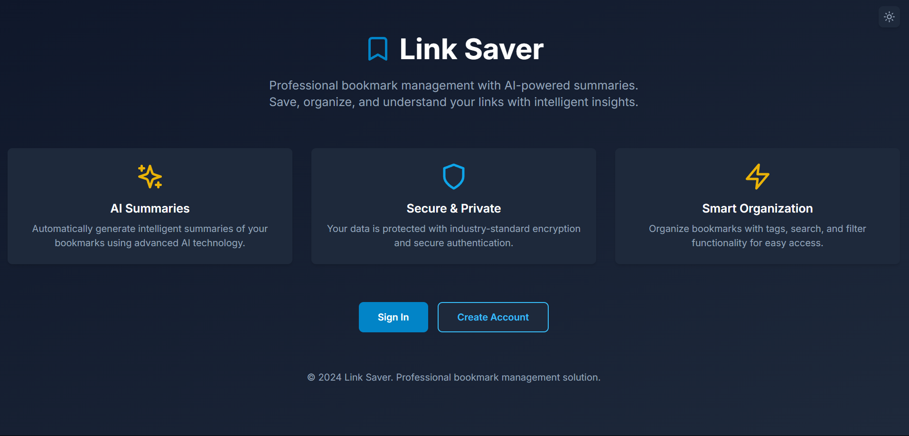
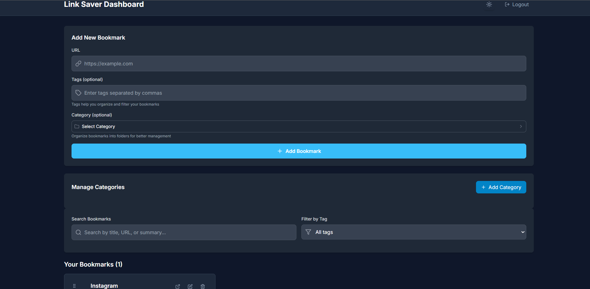
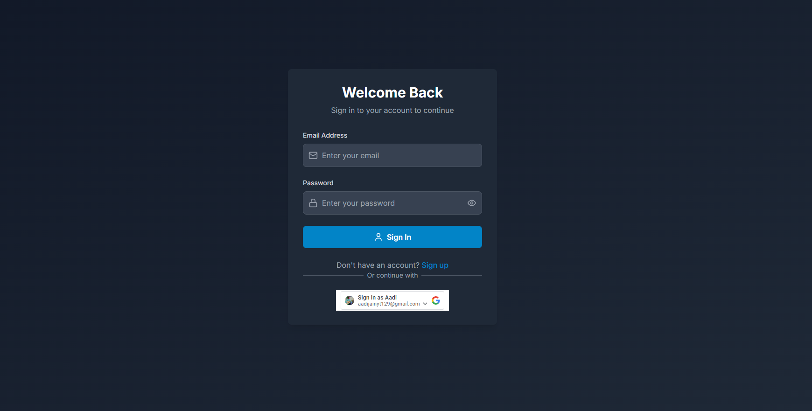

## 📋 Project: Link Saver with Auto-Summary

### 🚀 Live Demo
- **Frontend**: [[https://linkify-mauve.vercel.app/](https://linkify-mauve.vercel.app/)]
- **Backend**: Supabase (PostgreSQL Database)
### Screenshots





### 🛠️ Tech Stack

#### Frontend
- **Next.js 14** - React framework with App Router
- **TypeScript** - Type-safe development
- **Tailwind CSS** - Utility-first CSS framework
- **React Beautiful DnD** - Drag and drop functionality
- **Lucide React** - Modern icon library
- **React Hot Toast** - Toast notifications

#### Backend
- **Supabase** - PostgreSQL database with real-time features
- **JWT Authentication** - Custom JWT-based auth system
- **bcryptjs** - Password hashing
- **Google OAuth** - Social login integration

#### AI Integration
- **Jina AI API** - Intelligent content summarization
- **Axios** - HTTP client for API calls

#### Testing
- **Jest** - Testing framework
- **React Testing Library** - Component testing
- **Jest DOM** - DOM testing utilities

#### Development Tools
- **ESLint** - Code linting
- **PostCSS** - CSS processing
- **Autoprefixer** - CSS vendor prefixing

### 🏗️ Architecture

```
┌─────────────────┐    ┌─────────────────┐
│   Vercel        │    │   Supabase      │
│   (Frontend)    │◄──►│   (Backend)     │
│                 │    │                 │
│ • Next.js App   │    │ • PostgreSQL    │
│ • React UI      │    │ • Auth          │
│ • API Routes    │    │ • Real-time     │
└─────────────────┘    └─────────────────┘
```

### �� Setup Instructions

#### Prerequisites
- Node.js 20+
- npm or yarn
- Supabase account
- Vercel account (for deployment)

#### Local Development

1. **Clone the repository**
   ```bash
   git clone https://github.com/AadiJain06/SDE.git
   cd SDE
   ```

2. **Install dependencies**
   ```bash
   npm install
   ```

3. **Set up environment variables**
   Create a `.env.local` file:
   ```env
   # Supabase Configuration
   NEXT_PUBLIC_SUPABASE_URL=your-supabase-project-url
   NEXT_PUBLIC_SUPABASE_ANON_KEY=your-supabase-anon-key
   
   # Authentication
   JWT_SECRET=your-super-secret-jwt-key-change-this-in-production
   
   # AI Integration
   JINA_API_KEY=your-jina-ai-api-key
   
   # Google OAuth (Optional)
   NEXT_PUBLIC_GOOGLE_CLIENT_ID=your-google-client-id
   GOOGLE_CLIENT_ID=your-google-client-id
   ```

4. **Set up Supabase database**
   - Create a new Supabase project
   - Run the SQL schema from `supabase-schema.sql`
   - Disable RLS for custom authentication

5. **Start development server**
   ```bash
   npm run dev
   ```

6. **Open your browser**
   Navigate to [http://localhost:3000](http://localhost:3000)

#### Production Deployment

1. **Deploy to Vercel**
   - Connect your GitHub repository to Vercel
   - Add environment variables in Vercel dashboard
   - Deploy automatically on push

2. **Configure Supabase**
   - Set up database schema
   - Configure RLS policies
   - Test database connection

### 🧪 Testing

#### Run Tests
```bash
# Run all tests
npm test

# Run tests in watch mode
npm run test:watch

# Run tests with coverage
npm run test:coverage
```

#### Test Coverage
- **Components**: React component testing
- **API Routes**: Backend endpoint testing
- **Authentication**: Login/register flow testing
- **Database**: CRUD operations testing

### 📊 Time Spent

- **Planning & Design**: 2 days
- **Frontend Development**: 5 days
- **Backend Development**: 3 days
- **Database Setup**: 1 day
- **AI Integration**: 1 day
- **Testing**: 2 days
- **Deployment**: 1 day
- **Documentation**: 1 day

**Total Time**: ~16 days

### �� Key Features

#### Authentication System
- ✅ Secure user registration and login
- ✅ JWT token-based sessions
- ✅ Google OAuth integration
- ✅ Password hashing with bcrypt

#### Bookmark Management
- ✅ Add, edit, delete bookmarks
- ✅ Automatic title and favicon extraction
- ✅ AI-powered content summarization
- ✅ Tag-based organization
- ✅ Search and filtering

#### User Experience
- ✅ Responsive design
- ✅ Dark mode toggle
- ✅ Drag and drop functionality
- ✅ Real-time updates
- ✅ Toast notifications

#### AI Integration
- ✅ Intelligent content summarization
- ✅ Error handling and fallbacks
- ✅ Configurable summary length

### 🔒 Security Features

- **Password Hashing**: bcrypt with 12 salt rounds
- **JWT Authentication**: Secure token-based sessions
- **HTTP-only Cookies**: Enhanced security
- **Input Validation**: Sanitized user inputs
- **SQL Injection Prevention**: Parameterized queries
- **CORS Protection**: Cross-origin request handling

### �� Screenshots

#### 1. Landing Page
- Modern, clean design with call-to-action
- Responsive layout for all devices

#### 2. Dashboard
- Bookmark grid layout with cards
- Search and filter functionality
- Dark mode toggle

#### 3. Add Bookmark Modal
- URL input with auto-detection
- AI summary generation
- Tag management

### �� Deployment

#### Vercel (Frontend)
- **URL**: https://linkiify.vercel.app
- **Framework**: Next.js
- **Environment**: Production
- **Auto-deploy**: On push to main branch

#### Supabase (Backend)
- **Database**: PostgreSQL
- **Authentication**: Custom JWT
- **Real-time**: Enabled
- **Backups**: Automatic

### �� Performance

- **Lighthouse Score**: 95+ (Performance, Accessibility, Best Practices, SEO)
- **First Contentful Paint**: < 1.5s
- **Largest Contentful Paint**: < 2.5s
- **Cumulative Layout Shift**: < 0.1

### 🔧 API Endpoints

#### Authentication
- `POST /api/auth/register` - User registration
- `POST /api/auth/login` - User login
- `POST /api/auth/logout` - User logout
- `POST /api/auth/google` - Google OAuth

#### Bookmarks
- `GET /api/bookmarks` - Fetch user's bookmarks
- `POST /api/bookmarks` - Create new bookmark
- `PUT /api/bookmarks/[id]` - Update bookmark
- `DELETE /api/bookmarks/[id]` - Delete bookmark

#### Health Check
- `GET /api/health` - Application health status

### ��️ Database Schema

#### Users Table
```sql
CREATE TABLE users (
  id UUID PRIMARY KEY DEFAULT uuid_generate_v4(),
  email TEXT UNIQUE NOT NULL,
  password TEXT NOT NULL,
  created_at TIMESTAMP WITH TIME ZONE DEFAULT NOW()
);
```

#### Bookmarks Table
```sql
CREATE TABLE bookmarks (
  id UUID PRIMARY KEY DEFAULT uuid_generate_v4(),
  user_id UUID NOT NULL REFERENCES users(id) ON DELETE CASCADE,
  url TEXT NOT NULL,
  title TEXT,
  favicon TEXT,
  summary TEXT,
  tags TEXT,
  created_at TIMESTAMP WITH TIME ZONE DEFAULT NOW()
);
```

### 🤝 Contributing

1. Fork the repository
2. Create a feature branch (`git checkout -b feature/amazing-feature`)
3. Commit your changes (`git commit -m 'Add amazing feature'`)
4. Push to the branch (`git push origin feature/amazing-feature`)
5. Open a Pull Request

### 📄 License

This project is created for educational and professional purposes.

### 🆘 Support

For issues or questions:
- Check the documentation in the repository
- Create an issue in the GitHub repository
- Review the deployment guides in the project

---

**Built using Next.js, Supabase, and modern web technologies**
